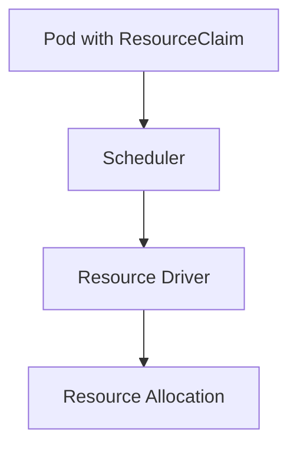

# Dynamic Resource Allocation Lab

## Summary

Kubernetes 1.33 graduates Dynamic Resource Allocation (DRA) to general availability, providing a standardized way for workloads to request specialized hardware through resource claims and driver-managed allocations.

## Context

- Objective: configure DRA on the lab cluster to provision custom resources (e.g., accelerators) on demand.
- Components: resource driver, `ResourceClass`, `ResourceClaim`, and workload manifests referencing the claims.
- Dependencies: compatible device plugin or resource driver capable of handling DRA claims.

## Use Case

Demonstrate a workload claiming an accelerator resource via `ResourceClaim` and validate that the pod only schedules when the driver fulfills the allocation.

## Experiment Checklist

1. Review and apply example DRA driver and `ResourceClass` manifests under `manifests/`.
2. Create `ResourceClaim` objects and observe allocation status transitions.
3. Deploy a sample workload referencing the claim and confirm scheduling/cleanup behavior.

## Notes

- Evaluate how DRA integrates with existing device plugin workflows and admission controls.
- Capture controller and driver logs to analyze allocation timelines and failure handling.

