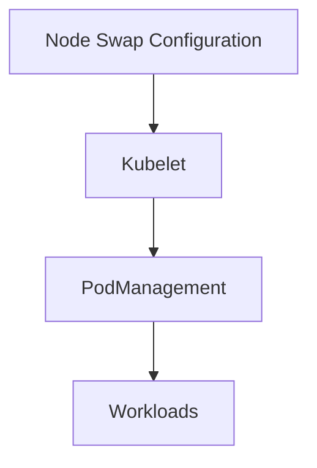

# Node Swap Support Lab

## Summary

Kubernetes 1.33 promotes node swap support to beta, enabling controlled swap usage to improve memory overcommit strategies while protecting latency-sensitive workloads.

## Context

- Objective: configure `k3s` nodes with swap enabled under the Kubernetes beta feature gates.
- Components: kubelet swap-related configuration, node-level swap partition, workload annotations for swap behavior.
- Dependencies: Linux host with swap configured, `NodeSwap` feature gate enabled on the cluster.

## Use Case

Validate that swap-enabled pods can run on the node, observe memory pressure responses, and compare performance impacts relative to swap-disabled pods.

## Experiment Checklist

1. Review kubelet config snippets under `manifests/` that enable controlled swap usage.
2. Configure the host swap partition as per the installer guidance and restart `k3s`.
3. Run memory-intensive workloads and monitor node metrics to evaluate swap behavior.

## Notes

- Collect `kubectl top node/pod` data to analyze memory usage and swap throttling effects.
- Document best practices for labeling workloads that should avoid swap usage entirely.

