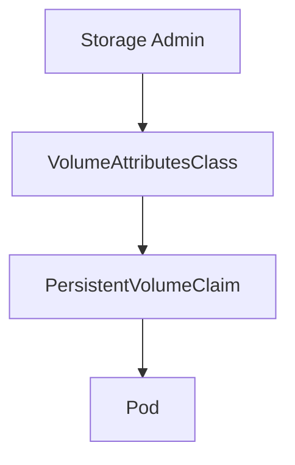

# Volume Attributes Class Lab

## Summary

Kubernetes 1.33 introduces the Volume Attributes Class API, allowing storage administrators to define reusable driver-specific attribute sets that can be referenced by persistent volume claims.

## Context

- Objective: configure a CSI driver with VolumeAttributesClass resources to simplify storage policy management.
- Components: CSI driver, `VolumeAttributesClass` objects, PVCs referencing the classes, and storage-backed workloads.
- Dependencies: CSI driver supporting the beta API surface and node-level access to the storage backend.

## Use Case

Deploy multiple workloads with PVCs referencing different `VolumeAttributesClass` objects to demonstrate consistent policy application without duplicating inline parameters.

## Experiment Checklist

1. Apply CSI driver sample configs and `VolumeAttributesClass` manifests located in `manifests/`.
2. Create PVCs for various workloads using different attribute classes and observe provisioning behavior.
3. Validate that storage parameters applied match the class definitions and audit for consistency.

## Notes

- Consider integrating with storage quota and snapshot policies to highlight operational benefits.
- Capture CSI driver logs to confirm receipt of class-specific attributes during provisioning.

