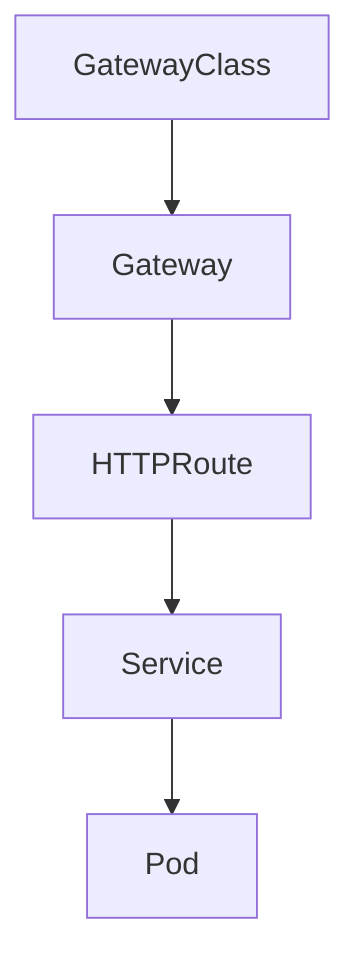

# Gateway API Consistency Lab

## Summary

Kubernetes 1.34 refines Gateway API consistency by aligning condition naming, clarifying cross-namespace reference rules, and improving conformance signals across resources.

## Context

- Goal: observe updated status propagation within Gateway API primitives on Kubernetes 1.34.
- Scope: GatewayClass, Gateway, HTTPRoute, and backend Services operating across namespaces.
- Dependencies: Gateway API CRDs v1beta1 and a controller that implements the 1.34 consistency changes.

## Use Case

Expose a demo application through an `HTTPRoute`, validate condition updates on associated Gateway resources, and experiment with cross-namespace route bindings under the new rules.

## Experiment Checklist

1. Apply the Gateway API CRDs and controller manifests found in `manifests/`.
2. Deploy sample backends and routes across two namespaces for comparison.
3. Monitor resource conditions with `kubectl get gateway,httproute -o yaml` and note behavioral differences.

## Notes

- Capture status snapshots before and after applying cross-namespace references to document consistency changes.
- Ensure the chosen controller advertises conformance with Gateway API v0.9 or later.

