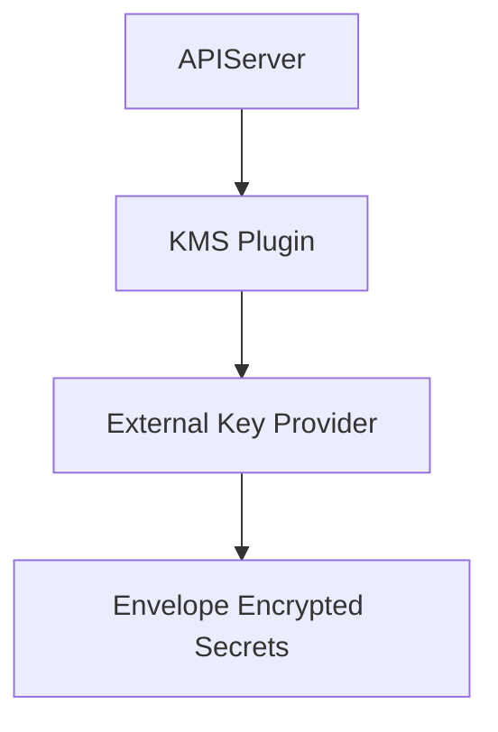

# KMS v2 Enhancements Lab

## Summary

Kubernetes 1.34 enhances KMS provider v2 integration with optimized envelope encryption performance, improved health reporting, and better observability for secret encryption workflows.

## Context

- Objective: configure `k3s` API server to leverage a v2 KMS plugin and evaluate performance and operational signals.
- Components: KMS provider plugin, external key management service, API server encryption configuration.
- Dependencies: secure connectivity between the cluster control plane and the external key management service.

## Use Case

Rotate encryption keys for Kubernetes secrets using the v2 provider, capture audit events and metrics, and validate fallback behavior when the provider becomes unavailable.

## Experiment Checklist

1. Review example encryption configuration under `manifests/` linking to the external KMS endpoint.
2. Enable API server encryption with the v2 provider and restart `k3s`.
3. Create and retrieve sample secrets to observe encryption at rest and log output.
4. Simulate provider disruption to confirm API server health checks and failover paths.

## Notes

- Consider enabling verbose logging on the KMS plugin to capture latency metrics before and after the 1.34 changes.
- Document key rotation procedures and expected recovery steps for the lab environment.

