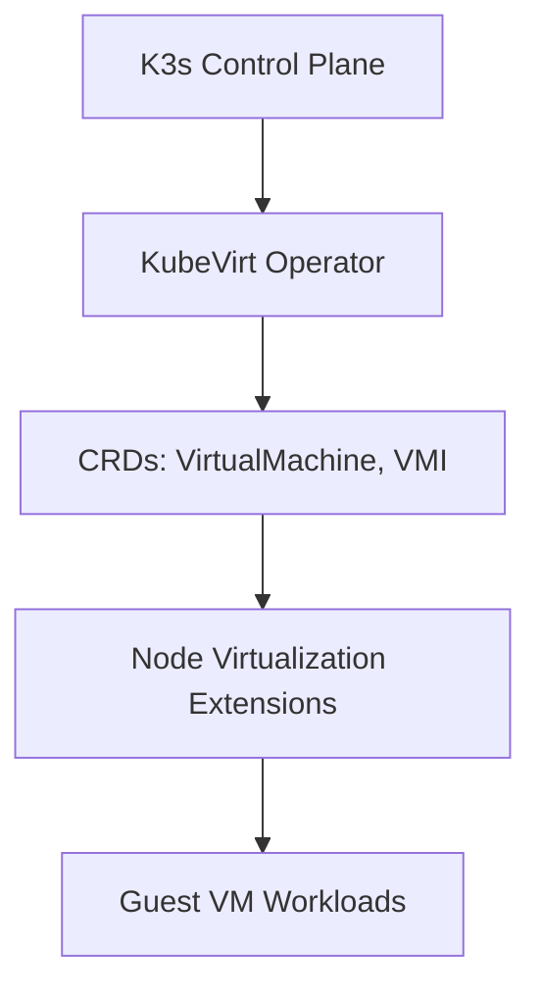

# KubeVirt Integration Lab

## Summary

KubeVirt brings virtual machines to Kubernetes, allowing virtualization workloads to run alongside containers. Kubernetes 1.34 improves compatibility and packaging to streamline deployment on lightweight distros such as `k3s`.

## Context

- Objective: enable VM orchestration on the single-node lab cluster with hardware virtualization support.
- Stack components: KubeVirt operator, CRDs, virt-controller, virt-api, virt-handler, Containerized Data Importer (CDI).
- Dependencies: hardware VT-x/AMD-V enabled, `kvm` modules present on the host, `kubectl`/`virtctl` CLIs installed on the admin station.

## Use Case

Provision a `VirtualMachine` resource backed by a container disk image, start it through `virtctl`, and verify lifecycle operations (`start`, `stop`, `delete`) operate smoothly on the cluster.

## Experiment Checklist

1. Apply the manifests under `manifests/` to install KubeVirt operator and CDI.
2. Validate CRDs and controller pods reach the `Ready` state.
3. Create a sample `VirtualMachine` manifest and observe scheduling on the node.
4. Interact with the guest via `virtctl console` to confirm end-to-end readiness.

## Notes

- Consider configuring default storage class and network attachment resources for VM disks and secondary interfaces.
- Capture host kernel module status via `lsmod | grep kvm` before running experiments.

