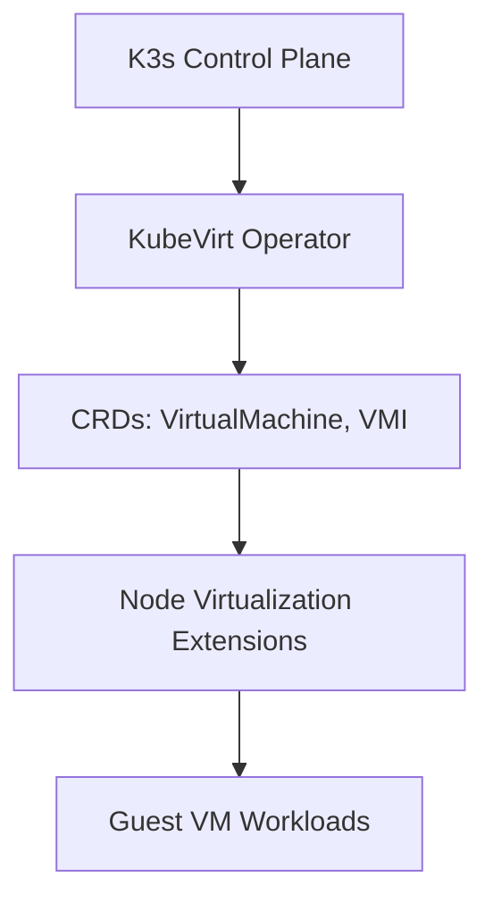

# KubeVirt Integration Lab



## Summary

KubeVirt brings virtual machines to Kubernetes, allowing virtualization workloads to run alongside containers. Kubernetes 1.34 improves compatibility and packaging to streamline deployment on lightweight distros such as `k3s`.

## Context

- Objective: enable VM orchestration on the single-node lab cluster with hardware virtualization support.
- Stack components: KubeVirt operator, CRDs, virt-controller, virt-api, virt-handler, Containerized Data Importer (CDI).
- Dependencies: hardware VT-x/AMD-V enabled, `kvm` modules present on the host, `kubectl`/`virtctl` CLIs installed on the admin station.

## Delivered CRDs

Captured via `kubectl get customresourcedefinitions.apiextensions.k8s.io | grep kubevirt`:

- **KubeVirt Core**: `kubevirts.kubevirt.io`, `virtualmachineinstances.kubevirt.io`, `virtualmachines.kubevirt.io`, `virtualmachineinstancereplicasets.kubevirt.io`, `virtualmachineinstancepresets.kubevirt.io`
- **Lifecycle Extensions**: `virtualmachineclones.clone.kubevirt.io`, `virtualmachinemigrations.kubevirt.io`, `migrationpolicies.migrations.kubevirt.io`, `virtualmachineinstancemigrations.kubevirt.io`
- **Profiles & Types**: `virtualmachineclusterinstancetypes.instancetype.kubevirt.io`, `virtualmachineinstancetypes.instancetype.kubevirt.io`, `virtualmachineclusterpreferences.instancetype.kubevirt.io`
- **Snapshots & Backups**: `virtualmachinesnapshots.snapshot.kubevirt.io`, `virtualmachinesnapshotcontents.snapshot.kubevirt.io`
- **Exports & Transfer**: `virtualmachineexports.export.kubevirt.io`, `objecttransfers.cdi.kubevirt.io`
- **CDI Data Management**: `cdis.cdi.kubevirt.io`, `cdiconfigs.cdi.kubevirt.io`, `dataimportcrons.cdi.kubevirt.io`, `datasources.cdi.kubevirt.io`, `datavolumes.cdi.kubevirt.io`, `volumeimportsources.cdi.kubevirt.io`, `storageprofiles.cdi.kubevirt.io`
- **Forklift Populators**: `openstackvolumepopulators.forklift.cdi.kubevirt.io`, `ovirtvolumepopulators.forklift.cdi.kubevirt.io`

See the annotated CRD capture in the installer guide: `docs/images/kubevirt-crds.png`.

## Demo Scenario: Cirros VM Lifecycle

This walkthrough exercises several CRDs (DataVolume, VirtualMachine) to import a cloud image, launch a VM, snapshot it, and clean up.

### 1. Prepare Namespace and Storage Import

```bash
kubectl apply -f features/134-kubevirt-integration/manifests/namespace.yaml
kubectl apply -f features/134-kubevirt-integration/manifests/data-volume-demo.yaml
```

Monitor import progress:

```bash
kubectl -n kubevirt-lab get datavolumes.cdi.kubevirt.io -w
```

### 2. Create the VirtualMachine

```bash
kubectl apply -f features/134-kubevirt-integration/manifests/virtualmachine-cirros.yaml
```

Start and interact via `virtctl`:

```bash
virtctl start cirros-vm -n kubevirt-lab
kubectl -n kubevirt-lab get vmis
virtctl console cirros-vm -n kubevirt-lab
```

Shut down when done:

```bash
virtctl stop cirros-vm -n kubevirt-lab
```

### 3. Explore Additional CRDs

- Create snapshots with `VirtualMachineSnapshot` objects.
- Clone the VM using `VirtualMachineClone` for rapid copies.
- Record migrations behavior (requires additional worker node) via `VirtualMachineInstanceMigration`.

Example snapshot manifest stub (fill in for future steps):

```yaml
# manifests/virtualmachinesnapshot-cirros.yaml (draft)
apiVersion: snapshot.kubevirt.io/v1alpha1
kind: VirtualMachineSnapshot
metadata:
  name: cirros-snap-1
  namespace: kubevirt-lab
spec:
  source:
    apiGroup: kubevirt.io
    kind: VirtualMachine
    name: cirros-vm
```

### 4. Cleanup

```bash
virtctl stop cirros-vm -n kubevirt-lab || true
kubectl delete -f features/134-kubevirt-integration/manifests/virtualmachine-cirros.yaml
kubectl delete -f features/134-kubevirt-integration/manifests/data-volume-demo.yaml
kubectl delete -f features/134-kubevirt-integration/manifests/namespace.yaml
```

## Use Case

Create a Linux virtual machine by importing a cloud image via CDI, applying an instance type and preference profile, and exercising migrations and snapshot/restore to validate the full lifecycle:

1. Import base image with a `DataVolume` and `VolumeImportSource`.
2. Define or reuse a `VirtualMachine` with instancetype/profile references.
3. Launch the guest, interact using `virtctl`, then capture a `VirtualMachineSnapshot`.
4. Trigger a `VirtualMachineInstanceMigration` (future multi-node scenario) and document behavior on a single-node cluster.
5. Clone the VM using `VirtualMachineClone` to explore rapid provisioning workflows.

## Experiment Checklist

1. Apply the manifests under `manifests/` to install KubeVirt operator and CDI.
2. Validate CRDs and controller pods reach the `Ready` state.
3. Create a sample `VirtualMachine` manifest and observe scheduling on the node.
4. Interact with the guest via `virtctl console` to confirm end-to-end readiness.
5. Enumerate CRDs and map them to lifecycle steps recorded above.

## Notes

- Consider configuring default storage class and network attachment resources for VM disks and secondary interfaces.
- Capture host kernel module status via `lsmod | grep kvm` before running experiments.
- The manifests directory is a staging area for example CRDs, DataVolume templates, and supporting objects as the exploration evolves.

