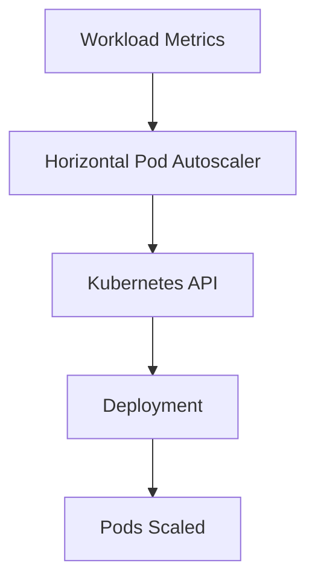

# Resilient Autoscaling Signals Lab

## Summary

Kubernetes 1.34 extends the Horizontal Pod Autoscaler with additional signal integrations and stability improvements, enabling more responsive scaling under fluctuating workloads.

## Context

- Objective: evaluate new autoscaling signal sources and resilience behaviors introduced in 1.34.
- Scope: HPA configuration leveraging custom/external metrics and pod readiness gates.
- Dependencies: metrics pipeline (Metrics Server or Prometheus adapter) capable of exposing the new signals.

## Use Case

Deploy a sample application emitting synthetic load metrics, configure an HPA to consume the enhanced signals, and observe scaling responsiveness and stability compared to prior releases.

## Experiment Checklist

1. Apply manifests in `manifests/` to deploy the demo workload, metrics adapter, and HPA configuration.
2. Trigger load variations and monitor HPA decisions using `kubectl describe hpa` and metrics dashboards.
3. Capture scaling events and note resilience improvements (e.g., fewer oscillations).

## Notes

- Consider running comparison tests against Kubernetes 1.33 to highlight behavioral differences.
- Document recommended metric thresholds and tuning knobs uncovered during experimentation.

